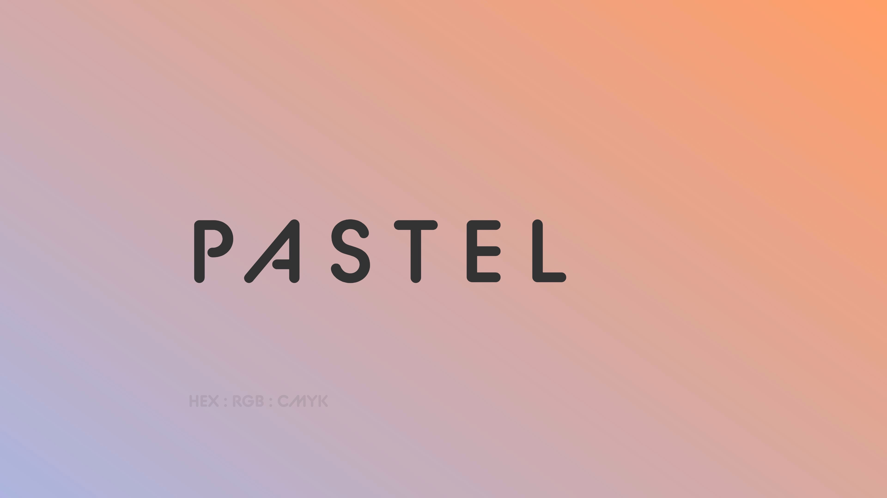

# pastel

> pastel randomly generates pastel color gradients with color details.

## Features

- Clipboard API copies gradient code to clipboard
- Algorithm to randomly generate only pastel colors

## Built With

- Bootstrap Studio
- Visual Studio Code

A Fork from [Tin Fung Chan](https://codepen.io/tin-fung-hk/pen/jOWXLQj)
